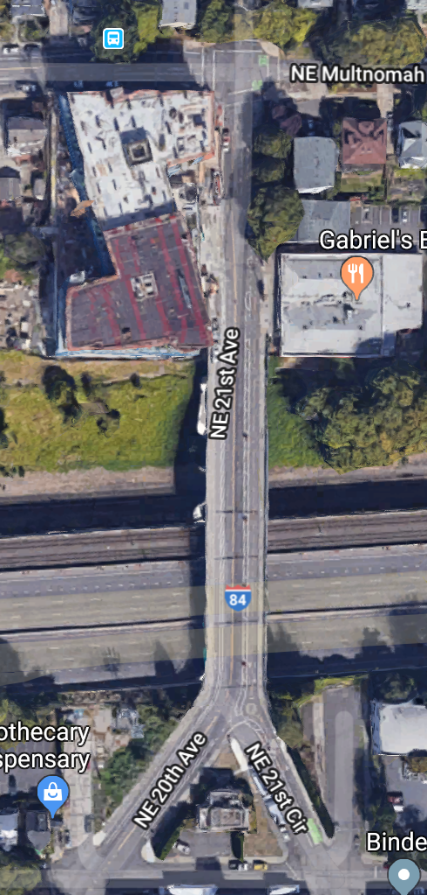

## Create an ArcGIS Account

Navigate to https://developers.arcgis.com/

1. Click `Sign Up For Free`
2. Fill in the form to register for your developer account
3. In a new tab, check your email and confirm your account

## Create a Webmap and Add Data
1. Go to arcgis.com and login
2. In the main nav bar, click `Map`, this will launch the Map Viewer
3. In the main nav bar, click `+ Add` and `Add Layer from Web`. Use the below URL to add the bike:

https://moraveclabsllc.maps.arcgis.com/home/item.html?id=d31135ff7a974b27b8c046f2f0eb5ef0

4. In the main nav bar, search `Richmond, Portland, Oregon'. Zoom to the appropriate level to view neighborhood roads.

5. Save the map.

## Symbolize bike data

In `Contents`, click `Portland Bike Data` and `Change Style` and select the following:

1. Choose an attribute to show: `BicycleStatus`
2. Select a drawing style:
    - In Types (Unique symbols) click Options and set the following:
        - Set color for neutral roads:
            - To the left of the `Neighborhood Street`, click the `Change Symbol` line
            - Add `#7570b3` in the hexadecimal color box
            - Click Ok to close the window.
            - Do the same for `Shared Lane` and `Other`
        - Set color for calm roads:
            - To the left of the `Designated Bikelane`, click the `Change Symbol` line
            - Add `#1b9e77` in the hexadecimal color box
            - Click Ok to close the window.
            - Do the same for `Neighborgood Greenway`, `Off-street Path or Trail` and `Protected Bikelane`
        - Set color for busy roads roads:
            - To the left of the `Highway`, click the `Change Symbol` line
            - Add `#d95f02` in the hexadecimal color box
            - Click Ok to close the window.
        - Click Ok > Done

## Configure popups

In `Contents`, click on `Portland Bike Data` > More Options ... > Configure Pop-up and set the following:

- Popup-Title: {BicycleStatus}
- Click Configure Attributes:
    - Uncheck all of the fields (Hint: At the top, select and unselect the Display checkbox.)
    Check the following and set the Field Alias:
        - {StreetName} Street Name
        - {RoadTypeOSM} Road Type in OSM
        - {Elevation} Elevation     
        - {OneWay} One Way
    - Use the up and down arrows to re-order the fields.
- Click OK
- Click on some `Portland Bike Data` features to view the styled pop-up.

## Sign up for an OpenStreetMap Account

1. Navigate to http://osm.org
2. Click "Sign Up" in the top right corner
3. Fill in the form to register for your OSM account
4. In a new tab, check your email and confirm your account

Today, we'll explore OpenStreetMap in the browser using `iD`

## Review the Map

1. Huzzah! You are now an OSM editor!
2. Return to http://osm.org
3. Spend some time reviewing the map
4. See anything missing? You can add an edit later!

## Getting started with iD

1. Click `Edit` and `Edit with iD`
2. Click on different roads to see how they're classified
**Don't worry, nothing is permanent until you save**

## Making an Edit

1. Click the magnifying glass to search for `21 Street and Sandy` 
2. Navigate to the `Y` split in the road, near I-84
3. Change the background to `Bing Aerial Imagery`
4. Click on `21st Street` view its designations
5. Notice that the bike lane has not yet been updated
6. We can help!
7. Select `Bike Lanes` from the `Add field` dropdown
8. Left side `opposite_lane`
9. Right side `lane`

We know that there is a bike lane that does not appear in OSM 
 

## Saving and Uploading

1. The upload button is located on the top left of the map
2. The upload button shows how many changes you've made
3. You have the chance to review your changes
4. **Changes are uploaded to OSM upon save**